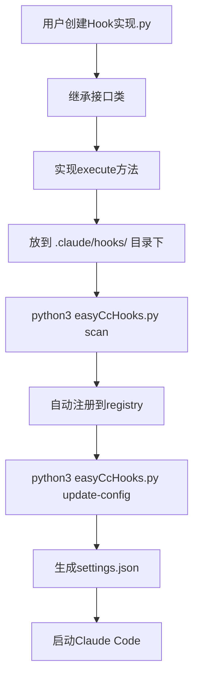

# Hook 框架架构与实现原理

本文档详细说明 Claude Code Hooks 框架的架构设计和实现原理,面向框架开发者和想要深入了解的用户。

## 目录

- [整体架构](#整体架构)
- [核心组件](#核心组件)
- [工作流程](#工作流程)
- [设计原则](#设计原则)
- [扩展指南](#扩展指南)

---

## 整体架构

### 两层架构

```
┌─────────────────────────────────────┐
│   用户层 (.claude/hooks/*.py)        │  用户实现业务逻辑
│   继承接口 → 实现 execute()           │
└─────────────────────────────────────┘
              ↓
┌─────────────────────────────────────┐
│   框架层 (easyCcHooks.py)        │  数据模型 + 接口定义
│   注册 → 配置生成 → 执行              │  + 注册中心 + 执行器 + CLI
└─────────────────────────────────────┘
```

### 目录结构

```
.claude/hooks/
├── easyCcHooks.py      # 框架核心 (数据模型 + 接口 + 注册中心 + 执行器 + CLI)
├── *.py                   # 用户自定义 hook 实现 (放在同目录下,自动加载)
├── ARCHITECTURE.md        # 架构文档 (本文件)
├── README.md              # 使用文档
└── tests/                 # 测试文件
    ├── example_hooks.py   # 示例 hook 实现 (ValidateBashCommand, WatchPreToolUse, InjectContext)
    ├── README.md          # 测试说明
    ├── test_input_dangerous.json
    ├── test_input_safe.json
    └── test_input_session.json
```

---

## 核心组件

所有核心组件集中在 `easyCcHooks.py` 一个文件中:

### 1. 数据模型 - 类型安全的输入输出

**作用**: 类型安全的数据结构

```python
@dataclass
class PreToolUseInput(HookInputBase):
    tool_name: str
    tool_input: Dict[str, Any]
    tool_use_id: str

    @classmethod
    def from_dict(cls, data: Dict) -> 'PreToolUseInput':
        """JSON → Python对象"""
        return cls(**data)

@dataclass
class PreToolUseOutput(HookOutputBase):
    permission_decision: Literal["allow", "deny", "ask"]
    permission_decision_reason: str

    def to_dict(self) -> Dict:
        """Python对象 → JSON"""
        return {...}
```

**核心价值**:
- 类型提示 → IDE 自动补全
- 自动序列化/反序列化
- 统一的数据格式

### 2. 抽象基类 & 接口定义

**作用**: 定义统一接口和继承体系

```python
class BaseHook(ABC):
    """所有 hook 的基类"""

    @abstractmethod
    def execute(self, input_data: HookInputBase) -> HookOutputBase:
        """强制子类实现"""
        pass

    @property
    def name(self) -> str:
        """自动从类名获取"""
        return self.__class__.__name__

    @property
    def matcher(self) -> str:
        """默认匹配所有工具"""
        return "*"
```

**继承层次**:
```
BaseHook
├── ToolHook (matcher属性)
│   ├── IPreToolUse
│   ├── IPostToolUse
│   └── IPermissionRequest
├── SessionHook
│   ├── ISessionStart
│   └── ISessionEnd
├── PromptHook
│   └── IUserPromptSubmit
└── ...
```

### 3. 注册中心 - 自动发现和注册

**作用**: 自动发现和注册 hook 实现

```python
class HookRegistry:
    @classmethod
    def scan_and_register(cls):
        """扫描当前文件及同目录下的 .py 文件"""
        # 1. 扫描当前文件 (easyCcHooks.py)
        cls._register_from_module(sys.modules[__name__])

        # 2. 扫描同目录下的其他 .py 文件
        hooks_dir = Path(__file__).parent
        for py_file in hooks_dir.glob("*.py"):
            if py_file.name == Path(__file__).name:
                continue
            spec = importlib.util.spec_from_file_location(...)
            mod = importlib.util.module_from_spec(spec)
            spec.loader.exec_module(mod)
            cls._register_from_module(mod)
```

**核心机制**:
- Python 反射 (importlib.util + inspect)
- 根据继承关系自动分类
- 无需手动注册

### 4. 执行器 - 运行时桥梁

**作用**: 运行时执行 hook

```python
class HookExecutor:
    @staticmethod
    def execute_from_stdin(hook_class_name: str):
        # 1. 从 stdin 读取 JSON
        input_data = json.load(sys.stdin)

        # 2. 找到 hook 类
        hook_class = HookRegistry.get_hook(hook_class_name)

        # 3. JSON → 数据模型
        input_model = INPUT_MODEL_MAP[hook_event].from_dict(input_data)

        # 4. 执行 hook
        output = hook_class().execute(input_model)

        # 5. 输出 JSON
        print(json.dumps(output.to_dict()))
```

**工作流程**:
```
Claude Code → stdin(JSON) → Executor → Hook实例 → stdout(JSON) → Claude Code
```

### 5. 配置管理器 - 自动生成 settings.json

**作用**: 自动生成 settings.json

```python
class ConfigManager:
    @staticmethod
    def generate_config() -> dict:
        for hook_type, hooks in registry.items():
            for hook in hooks:
                config["hooks"][hook_type].append({
                    "hooks": [{
                        "type": "command",
                        "command": f'python3 "$CLAUDE_PROJECT_DIR"/.claude/hooks/easyCcHooks.py execute {hook.__name__}',
                        "timeout": hook().timeout
                    }],
                    "matcher": hook().matcher  # 如果是工具级hook
                })
```

---

## 工作流程

### 1. 开发流程



### 2. 运行时流程


### 3. 配置生成流程

```python
# 步骤 1: 扫描
scan_and_register()
  → 扫描 .claude/hooks/*.py
  → 发现 ValidateBashCommand 继承自 IPreToolUse
  → 注册到 registry["PreToolUse"]

# 步骤 2: 生成配置
generate_config()
  → 遍历 registry["PreToolUse"]
  → 为 ValidateBashCommand 生成配置:
    {
      "matcher": "Bash",
      "hooks": [{
        "type": "command",
        "command": "python3 ... easyCcHooks.py execute ValidateBashCommand"
      }]
    }

# 步骤 3: 写入文件
update_settings(".claude/settings.json")
  → 合并新配置
  → 写入文件
```

---

## 设计原则

### 1. 约定优于配置

**体现**:
- 继承关系 → 自动分类
- 类属性 → 自动配置
- 放到 hooks 目录 → 自动加载

**优势**:
- 减少样板代码
- 降低学习成本
- 统一的编码风格

### 2. 关注点分离

**用户只关心**: 业务逻辑
```python
def execute(self, input_data):
    if dangerous(input_data):
        return deny()
    return allow()
```

**框架负责**: 基础设施
- JSON 解析
- 类型转换
- 配置生成
- 错误处理

### 3. 类型安全

**dataclass + 类型提示**:
```python
def execute(self, input_data: PreToolUseInput) -> PreToolUseOutput:
    command: str = input_data.tool_input.get("command")
    #        ↑ IDE自动提示类型
```

### 4. 可测试性

**独立测试**:
```bash
# 不需要 Claude Code 运行
python3 easyCcHooks.py test ValidateBashCommand --input tests/test_input_dangerous.json
```

**单元测试**:
```python
def test_hook():
    input_data = PreToolUseInput(...)
    output = ValidateBashCommand().execute(input_data)
    assert output.permission_decision == "deny"
```

### 5. 渐进式复杂度

**初学者**: 只需实现 execute
```python
class SimpleHook(IPreToolUse):
    def execute(self, input_data):
        return PreToolUseOutput(permission_decision="allow")
```

**进阶**: 自定义配置
```python
class AdvancedHook(IPreToolUse):
    @property
    def matcher(self) -> str:
        return f"{ToolName.Bash}|{ToolName.Edit}"

    @property
    def timeout(self) -> int:
        return 30

    def execute(self, input_data):
        # 复杂逻辑
```

---

## 扩展指南

### 添加新的 Hook 实现

只需在 `.claude/hooks/` 目录下创建一个 `.py` 文件,继承对应接口:

```python
# .claude/hooks/MyCustomHook.py
from easyCcHooks import IPreToolUse, PreToolUseInput, PreToolUseOutput

class MyCustomHook(IPreToolUse):
    """我的自定义 Hook"""

    @property
    def matcher(self) -> str:
        return "Bash"

    def execute(self, input_data: PreToolUseInput) -> PreToolUseOutput:
        return PreToolUseOutput(permission_decision="allow")
```

然后运行:
```bash
python3 easyCcHooks.py scan          # 确认注册
python3 easyCcHooks.py update-config # 写入配置
```

### 添加新的 Hook 类型

如果 Claude Code 将来添加新的 hook 类型,在 `easyCcHooks.py` 中:

**步骤 1**: 添加数据模型
```python
@dataclass
class PreComputeInput(HookInputBase):
    compute_type: str

@dataclass
class PreComputeOutput(HookOutputBase):
    should_proceed: bool
```

**步骤 2**: 添加接口
```python
class IPreCompute(BaseHook):
    @abstractmethod
    def execute(self, input_data: PreComputeInput) -> PreComputeOutput:
        pass
```

**步骤 3**: 更新注册中心和类型映射
```python
_hooks["PreCompute"] = []
_INTERFACE_MAP["PreCompute"] = IPreCompute
INPUT_MODEL_MAP["PreCompute"] = PreComputeInput
```

### 自定义装饰器

添加配置装饰器:

```python
def hook_config(matcher="*", timeout=10, priority=0):
    def decorator(cls):
        cls._hook_config = {
            "matcher": matcher,
            "timeout": timeout,
            "priority": priority
        }
        return cls
    return decorator

# 使用
@hook_config(matcher="Bash", timeout=30)
class MyHook(IPreToolUse):
    def execute(self, input_data):
        ...
```

---

## 技术细节

### Python 反射机制

**importlib.util**:
```python
# 动态加载 .py 文件
spec = importlib.util.spec_from_file_location(module_name, py_file)
mod = importlib.util.module_from_spec(spec)
spec.loader.exec_module(mod)
```

**inspect.getmembers**:
```python
# 获取模块中的所有类
for name, obj in inspect.getmembers(module, inspect.isclass):
    if issubclass(obj, IPreToolUse):
        # 找到hook实现
```

### 工厂模式

**根据字符串创建实例**:
```python
INPUT_MODEL_MAP = {
    "PreToolUse": PreToolUseInput,
}

# 根据hook类型动态创建
hook_event = "PreToolUse"
input_class = INPUT_MODEL_MAP[hook_event]
input_obj = input_class.from_dict(json_data)
```

---

## 总结

### 框架核心价值

1. **自动化**: 扫描、注册、配置生成全自动
2. **类型安全**: dataclass + 类型提示
3. **低门槛**: 用户只需实现 execute
4. **可测试**: 独立于 Claude Code 测试
5. **单文件框架**: 所有框架代码集中在 `easyCcHooks.py`

### 架构

| 组件 | 位置 | 作用 |
|------|------|------|
| 数据模型 | easyCcHooks.py | 10种hook的输入输出 dataclass |
| 抽象基类 | easyCcHooks.py | 继承体系定义 |
| 接口定义 | easyCcHooks.py | 10种hook抽象接口 |
| 注册中心 | easyCcHooks.py | 自动发现和注册 |
| 执行器 | easyCcHooks.py | 运行时执行 |
| 配置管理 | easyCcHooks.py | settings.json 管理 |
| CLI | easyCcHooks.py | 命令行工具 |

用户实现一个 hook 平均只需 **~20 行代码**!

---

**文档版本**: 2.0
**最后更新**: 2026-02-22
